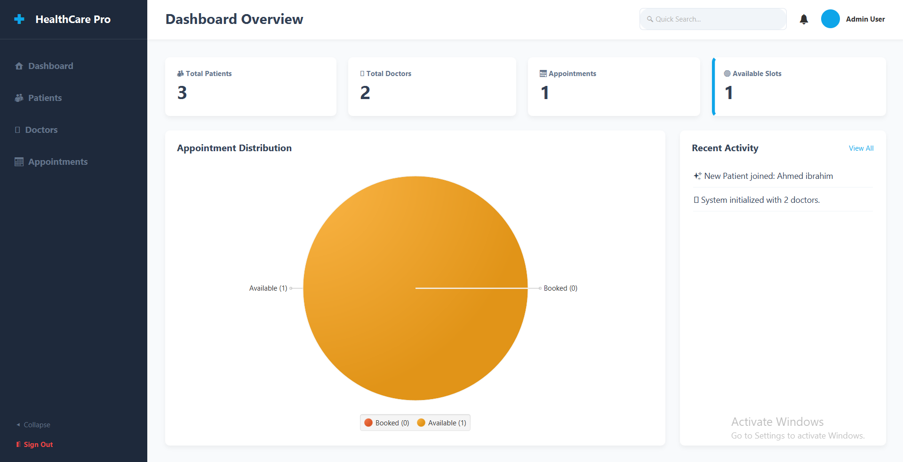

# HealthCare Pro - Hospital Management System

[](https://www.oracle.com/java/)
[](https://openjfx.io/)
[](https://www.sqlite.org/)
[](https://opensource.org/licenses/MIT)

An enterprise-grade Hospital Management System designed to streamline administrative workflows, manage patient and doctor records, and efficiently handle appointment scheduling. Upgraded from a foundational Console OOP application into a modern GUI application using JavaFX and SQLite.

## ✨ Features

- **📊 Dynamic Dashboard:** Visual real-time statistics and interactive charts.
- **👥 Patient Management:** Register, update, delete, and search patient records.
- **🩺 Doctor Directory:** Manage medical staff, specializations, and consultation fees.
- **📅 Appointment Scheduling:** Create available slots, book patients, and track statuses via visual badges.
- **🔍 Advanced Search & Filtering:** Filter patients by blood type, appointments by status, and real-time multidimensional search.
- **💾 Data Persistence:** SQLite database integration ensuring all data is securely saved.
- **🛡️ Secure Architecture:** Built using strict MVC patterns and secure Prepared Statements.

## 🏗️ Architecture

The application is structured using the **Model-View-Controller (MVC)** architectural pattern combined with the **Data Access Object (DAO)** pattern for seamless database interaction.

- **Model:** Pure POJOs utilizing strict OOP principles (Inheritance, Polymorphism, Encapsulation).
- **View:** Declarative FXML files styled with custom enterprise CSS.
- **Controller:** Java classes bridging the UI components with the core business logic.
- **Service/DAO:** A centralized `HospitalSystem` Singleton handles logic, while DAOs execute raw SQLite statements safely.

## 💻 Technologies Used

- **Language:** Java 17
- **UI Framework:** JavaFX 17
- **Database:** SQLite (JDBC)
- **Build Tool:** Maven
- **Design Pattern:** MVC, DAO, Singleton

## 🚀 Installation & Setup

1. **Clone the repository:**
   ```bash
   git clone https://github.com/YourUsername/hospital-management-system.git
   cd hospital-management-system
   ```

2. **Build the project using Maven:**
   ```bash
   mvn clean install
   ```

3. **Run the Application:**
   ```bash
   mvn javafx:run
   ```
   *Note: The SQLite database (`hospital.db`) is automatically initialized upon the first run.*

## 📸 Screenshots

| Login Screen | Dashboard Overview |
| :---: | :---: |
|  |  |

| Patients Directory | Appointment Scheduling |
| :---: | :---: |
|  |  |

*(Note: Replace placeholder images in `docs/screenshots` with actual application captures).*

## 🔮 Future Improvements

- Add a dedicated **Billing & Invoicing Module**.
- Implement **Role-Based Access Control (RBAC)** for Admin vs. Doctor perspectives.
- Add password hashing (e.g., BCrypt) for authenticating users.
- Shift database read/writes to background threads (`javafx.concurrent.Task`) to optimize UI responsiveness.

## 📄 License

This project is licensed under the MIT License - see the [LICENSE](LICENSE) file for details.
