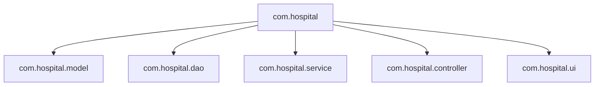
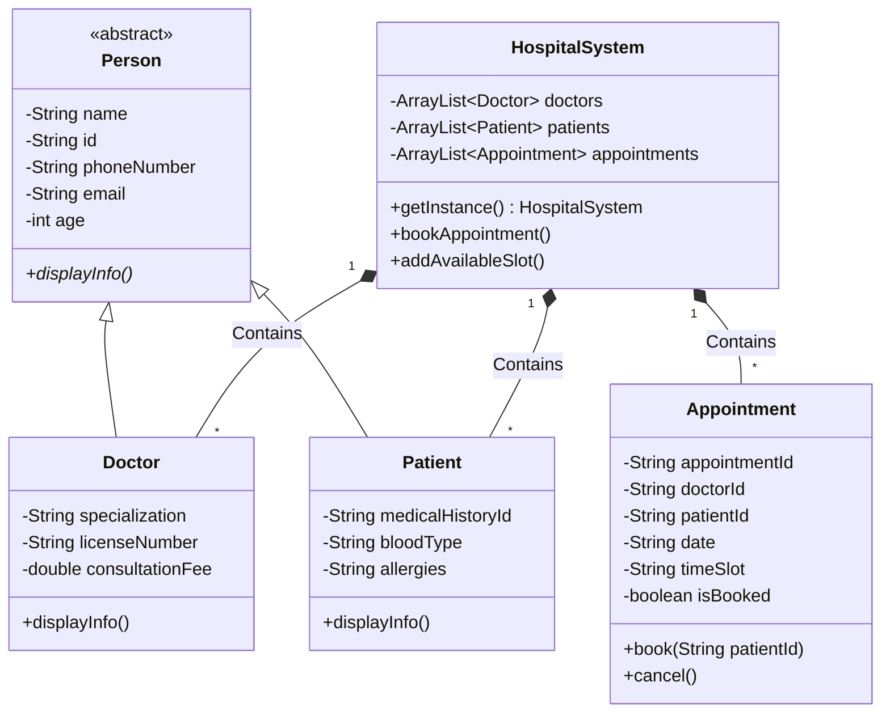
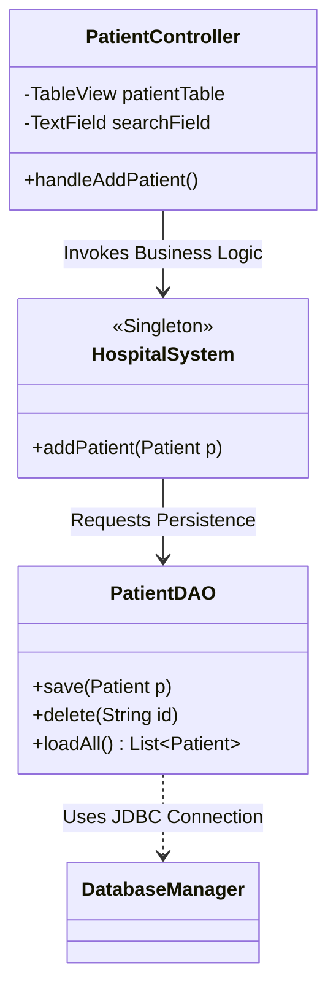

# HealthCare Pro - UML Documentation

## 1. Package Architecture



## 2. Core Class Diagram (OOP & Models)



## 3. Database DAO & MVC Integration Diagram



## 4. System Use Case Diagram

```mermaid
usecaseDiagram
    actor Admin
    
    rectangle "Hospital Management System" {
        Admin --> (Secure Login)
        Admin --> (View Dashboard Statistics)
        Admin --> (Add/Edit/Delete Patients)
        Admin --> (Add/Edit/Delete Doctors)
        Admin --> (Create Available Appt Slots)
        Admin --> (Book Patients to Slots)
        Admin --> (Search & Filter Records)
    }
```